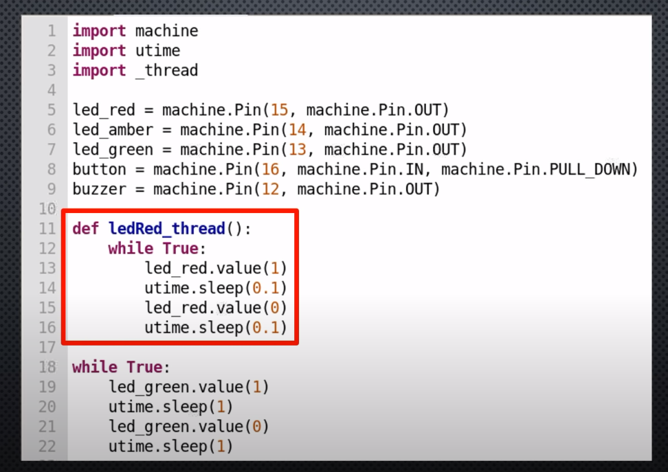
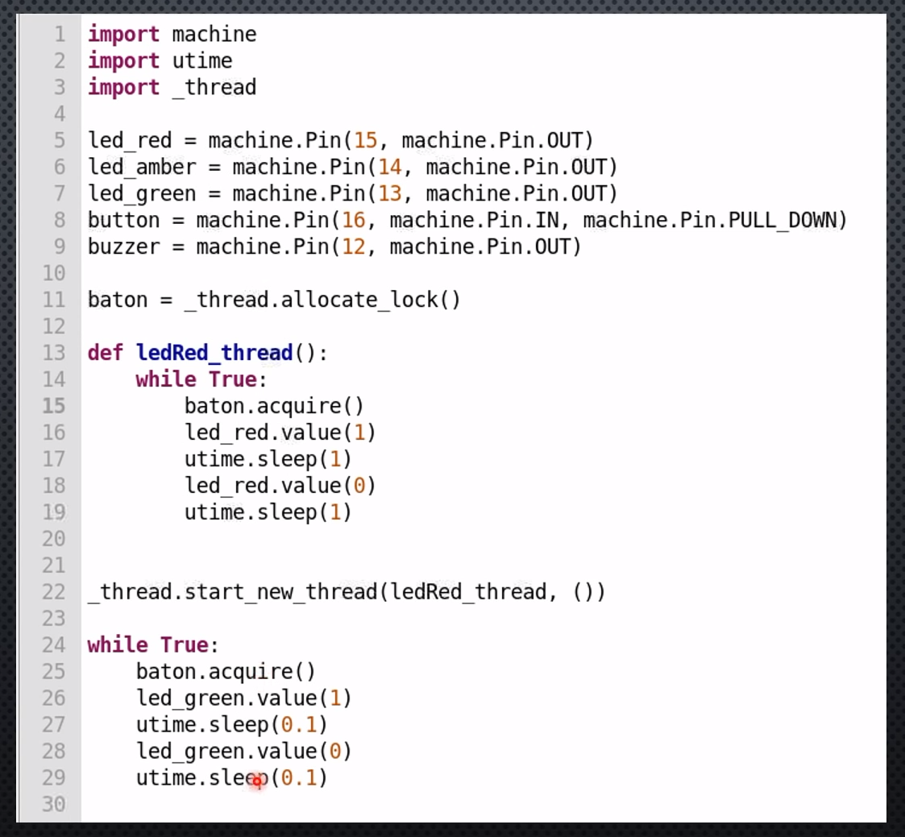
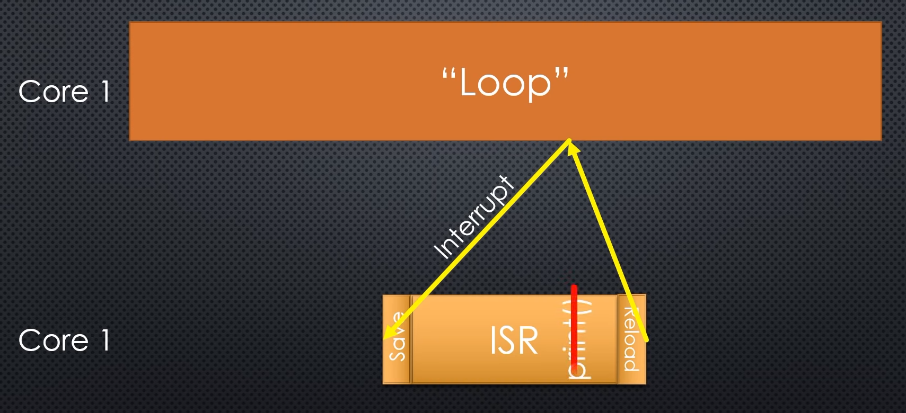
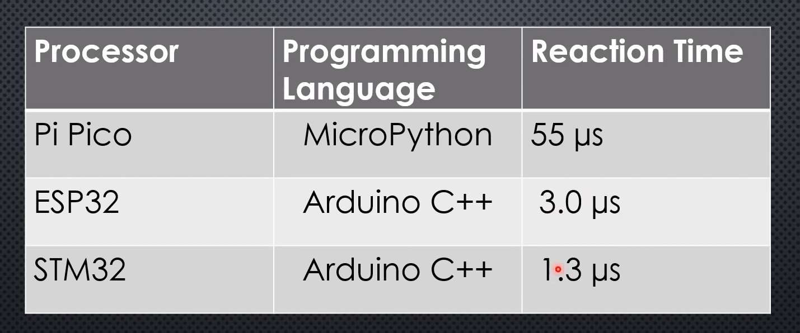
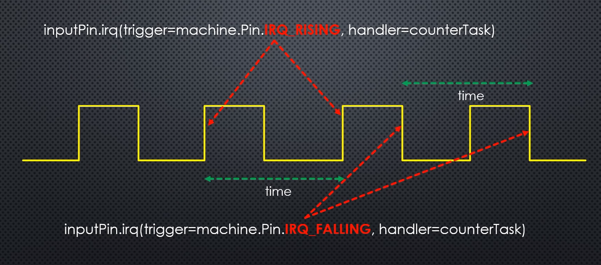
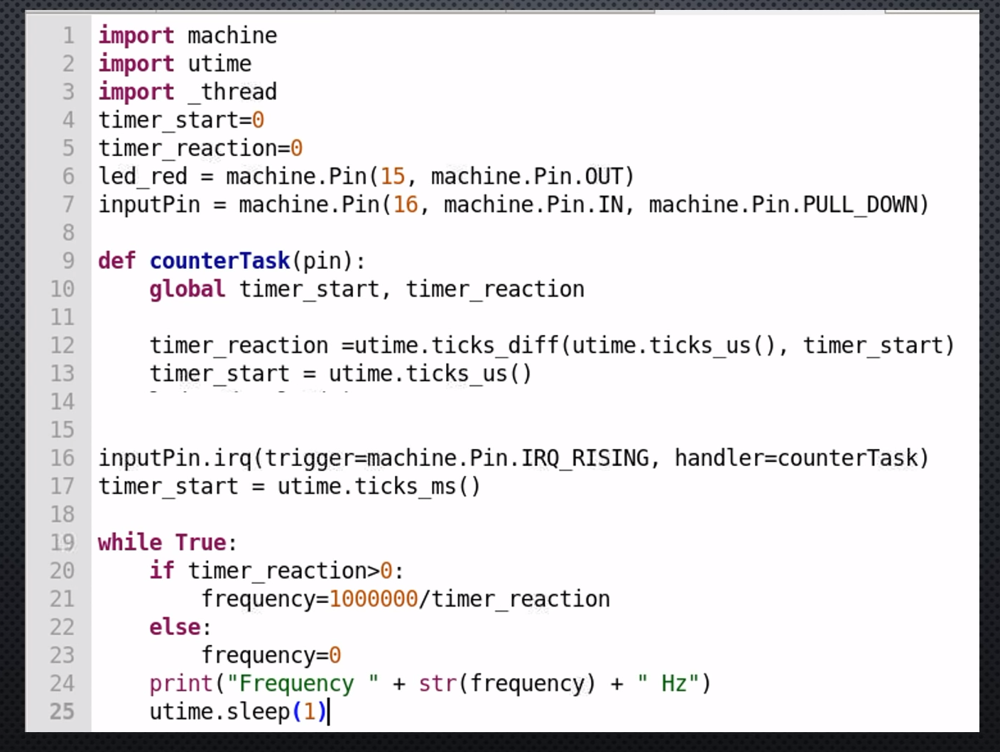

## TODO

### Excepciones debigo a capacidad:
* memoria
* más de 2 threads

Imágenes del video de sipessa https://www.youtube.com/watch?v=9vvobRfFOwk

### Thread

capítulo 5 de RPi_PiPico_Digital_v10.pdf

Vídeo de sipessa https://www.youtube.com/watch?v=9vvobRfFOwk

### Interrupciones

capitulo 6 de RPi_PiPico_Digital_v10.pdf

